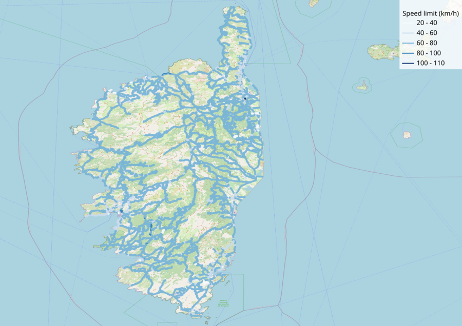

# Road-Network Imports for METROPOLIS2

This repository contains Python scripts to import a road network from various data providers
(although only OpenStreetMap is supported for now).

**Compatible METROPOLIS2 version:** `1.0.0`



## Requirements

To install the required Python packages, you can either use `pip` (it is recommended to use a
[virtual environment](https://virtualenv.pypa.io/en/latest/)):

```
pip install -r requirements.txt
```

Or create a new conda environment with:

```
conda env create -f environment.yml
```

The code has been tested with Python version `3.12.2` only.

## Configuration

The `config.toml` file is used to specify all the configuration variables (paths to the input /
output files, default values for some variables, etc.).

**By default, the script will read the `config.toml` file in the current working directory.**
To specify a different configuration file, you can use the `--config` command-line option.
For example:

```
python python/write_metropolis_edges.py --config my-config.toml
```

## Step 1: Download the input data

### OpenStreetMap

To import a road network from OpenStreetMap data, you need to obtain a `.osm.pbf` file of your study
area.
One way to do so is to download an extract for your region on
[Geofabrik](https://download.geofabrik.de).
Check the [OSM wiki](https://wiki.openstreetmap.org/wiki/Downloading_data) for more solutions.

## Step 2: Import the data

This step consists in reading the input data and creating a GeoDataFrame with the imported edges.

### OpenStreetMap

For OpenStreetMap, you need to run the script `import_osm.py`:

```
python python/import_osm.py
```

The `config.toml` file needs to contain the following key-value pairs:

- `crs`: The projected coordinate system to use for metric operations (e.g., computing edges's
  length). The value can be anything that is accepted by the [pyproj
  package](https://pyproj4.github.io/pyproj/stable/api/crs/crs.html#pyproj.crs.CRS.from_user_input).
  You need to make sure to use a projection that is adapted for you study area. For France, the
  recommanded CRS is `"EPSG:2154"` (Lambert).
- `raw_edges_file`: Path to the file where the imported edges will be stored. Accepted formats:
  Parquet, GeoJSON, FlatGeobuf, GeoPackage, Shapefile.
- `osm.input_file`: Path to the `.osm.pbf` file to import from.
- `osm.highways`: List of [highway tags](https://wiki.openstreetmap.org/wiki/Key:highway) to import.
- `osm.urban_landuse`: Optional list of [landuse
  tags](https://wiki.openstreetmap.org/wiki/Key:landuse) to be classified as urban areas. If
  ommitted, the edges will not be classified between urban and rural.

The ouput file is a GeoDataFrame with the following columns:

- `geometry`: LineString of the edge (using EPSG:4326 coordinates).
- `source`: OSM id of the source node.
- `target`: OSM id of the target node.
- `length`: Length of the edge, in meters.
- `speed`: Speed limit of the edge, in km/h (if specified in OSM).
- `lanes`: Number of lanes on the edge (if specified in OSM).
- `urban`: Whether the edge is in a urban area.
- `osm_id`: OSM id of the corresponding way in OSM (_not unique_).
- `name`: Name of the edge (if specified in OSM).
- `road_type`: OSM highway tag of the edge.
- `id`: Unique identifiers for the edges (created by the script).

## Step 3: Post-processing

This step consists in some additional computations, common to all data providers to make the road
network ready to use with METROPOLIS2.

To run this step, execute the script `postprocess_network.py`:

```
python python/postprocess_network.py
```

The following operations are performed:

- Default values are set for the `speed`, `lanes` and `capacity` variables so that there is no null
  values.
- If parallel edges are found, only the one with the largest capacity (smallest travel time in case
  of tie) is kept.
- The edges which are not part of the largest strongly connected component of the graph are removed
  (unless the `postprocess_network.ensure_connected` configuration parameter is set to `false`, in
  which case some origin-destination pairs might not be feasible in METROPOLIS2).
- The edges are re-indexed so that all ids are unique and range between 0 and `n-1` where `n` is the
  number of edges.
- Lower bounds are enforced for the number of lanes, the speed-limit and the length.
- The `target_count` variable is computed: number of incoming edges for the target node of the edge.

The `config.toml` file needs to contain the following key-value pairs:

- `raw_edges_file`: Path to the file where the imported edges are stored. Accepted formats:
  Parquet, GeoJSON, FlatGeobuf, GeoPackage, Shapefile.
- `clean_edges_file`: Path to the file where the edges will be stored after postprocessing.
  This path can be the same as `raw_edges_file` if you just want to replace the imported file.
  Accepted formats: Parquet, GeoJSON, FlatGeobuf, GeoPackage, Shapefile.
- `postprocess_network.default_speed`: Default speed limits for urban and rural areas, for each
  `road_type`.
- `postprocess_network.default_nb_lanes`: Default number of lanes, for each `road_type`.
- `postprocess_network.default_capacity`: Default bottleneck capacity, for each `road_type`.

## Step 4: Writing METROPOLIS2 input

This step will write a CSV or Parquet file of the road network, compatible with the METROPOLIS2
simulator.

To run this step, execute the script `write_metropolis_edges.py`:

```
python python/write_metropolis_edges.py
```

The `config.toml` file needs to contain the following key-value pairs:

- `clean_edges_file`: Path to the file where the edges will be stored after postprocessing.
  This path can be the same as `raw_edges_file` if you just want to replace the imported file.
  Accepted formats: Parquet, GeoJSON, FlatGeobuf, GeoPackage, Shapefile.
- `metropolis.input_directory`: Path to the directory where the edges input file will be stored.
- `metropolis.format`: Format to be used for the input file (either `"CSV"` or `"Parquet"`).
